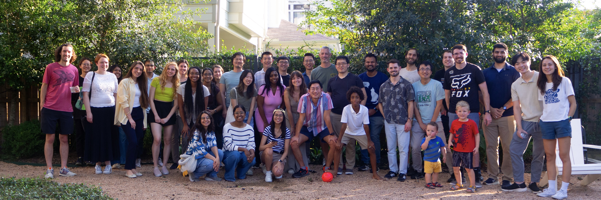

---
hide:
  - toc
---

  

Interested in joining our group? Get in touch at the addresses below! You can also now keep tabs on our publications, activity, and general scientific musings by visiting our Instagram page.

- Email: [caleb.bashor@rice.edu](mailto:caleb.bashor@rice.edu)
- Phone: (713)348-8231
- Address: Rice University BRC 820 ([6500 Main St, Houston, TX 77030](https://maps.app.goo.gl/pYs2ZKzcHBGEXALK7))
- [Bashor Lab Instagram](https://www.instagram.com/bashor_lab/)
