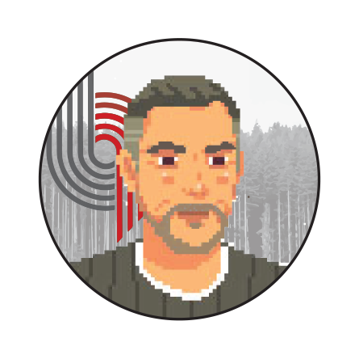

---
hide:
  - toc
---

<link rel="stylesheet" href="../assets/page/roster.css" />

# OUR GROUP

### Olivia Flynn

{:.profile-pic}

**PhD Student** - Systems, Synthetic, and Physcial Biology

- B.S. Chemical Engineering, University of Notre Dame

### Tawan (Pop) Kiratiwongwan

{:.profile-pic}

**PhD Student** - Bioengineering

- B.BmE. Bioengineering, University of Minnesota

### Zheng Diao

{:.profile-pic}

**PhD Student** - Systems, Synthetic, and Physcial Biology

- B.S. Biochemistry, University of Minnesota

### Alena Streletskaia

{:.profile-pic}

**PhD Student** - BioSciences

- B.S./M.S. Pharmaceutical Sciences, Lomonosov Moscow State University

### Kshitij Rai

{:.profile-pic}

**PhD Student** - Systems, Synthetic, and Physcial Biology

- B.Eng./M.Eng. Chemical Engineering & Biotechnology, Indian Institute of Technology (IIT) Delhi

### AJ Walters

{:.profile-pic}

**PhD Student** - Bioengineering

- B.S. Biological/Biosystems Engineering, Utah State University

### Matthew Lee

{:.profile-pic}

**PhD Student** - Bioengineering

- B.S. Materials Engineering, Johns Hopkins University

### Yiduo Wang

{:.profile-pic}

**PhD Student** - Bioengineering

- B.S. Biochemistry & Computer Science, University of Wisconsin, Madison

### Passa Pungchai

{:.profile-pic}

**PhD Student** - Bioengineering

- B.S. Bioengineering, University of California, Los Angeles

### Alice Zhou

**Undergraduate** - Bioengineering

### Hanan Aro

**Undergraduate** - Bioengineering

### Lauryn Piggatt

**Undergraduate** - Bioengineering

### Mustafa Latif

**Undergraduate** - Bioengineering

### Priyanka Subramanian

**Undergraduate** - Bioengineering

### Stephanie Agu

**Undergraduate** - Bioengineering

### Thunyapat Silpsamrit

**Undergraduate** - Bioengineering

### Tommy Nguyen

**Undergraduate** - Computer Science

### Caleb Bashor

{:.profile-pic}

- Principal Investigator
- Post Doc, Massachusetts Institute of Technology
- Ph.D Biophysics, University of California, San Francisco
- B.A. Biochemistry, Reed College
